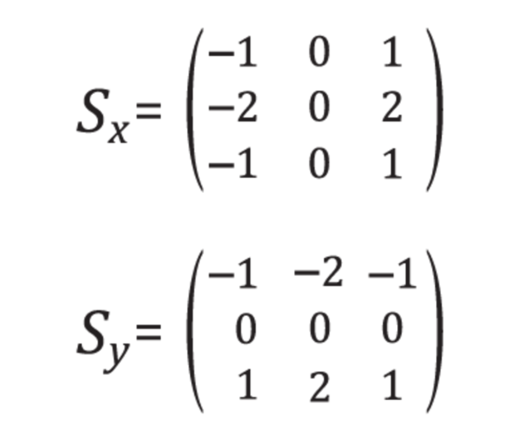

# CNN

The MLP turn the pixels to vectors and don't analyze them a group. There are half million links between the input and hidden layers. 
And the pictures are pre- trained, they are all in center, they all in grey color scale and their sizes are almost the same. But in real life the numbers can be anywhere. 

Convolutional Neural Network is a solution for these problems. 

- You shouldn't be worried about the place of an image or color of an image. 
- It can remember spatial information. 
- Look at image as a whole. 
- Convolutional layer applies different image filters
- Result of different image filters have different appearances.

What kind of features are stored in those filters? 
- The edge of object
- The colors hat distiguish different classes of images

Then those filters are combined to get the output.

## Filters

********************
Ref: https://classroom.udacity.com/courses/ud188/lessons/b1e148af-0beb-464e-a389-9ae293cb1dcd/concepts/cf271c4a-ea13-4166-bed4-61cac9958e1c

Filters
To detect changes in intensity in an image, you’ll be using and creating specific image filters that look at groups of 
pixels and react to alternating patterns of dark/light pixels. These filters produce an output that shows edges of 
objects and differing textures.

So, let’s take a closer look at these filters and see when they’re useful in processing images and identifying 
traits of interest.

************************

Spatial patterns of an image:

- color
- shape

Let's focus on shape:

It can be thought as the intensity of an image. **Intensity** is a measure of light and dark. You can find the shape boundry
with separating the brightness of the image and background. 

You can detech the edges of an object by looking at abrupt changes in intensity.

### Frequency

Ref: https://classroom.udacity.com/courses/ud188/lessons/b1e148af-0beb-464e-a389-9ae293cb1dcd/concepts/11ed5daf-90ec-4f29-9ffd-b1aeb132497b

Frequency in images is a rate of change. 

Images change in space, and a high frequency image is one where the intensity changes a lot. And the level of brightness
changes quickly from one pixel to the next. 
 
A low frequency image may be one that is relatively uniform in brightness or changes very slowly.

Most images have both high-frequency and low-frequency components.

High-frequency components also correspond to the edges of objects in images, which can help us classify those objects.

### Edge Handling
Ref: https://classroom.udacity.com/courses/ud188/lessons/b1e148af-0beb-464e-a389-9ae293cb1dcd/concepts/08495a99-5ca0-4030-ba22-b0d73d57deda

Kernel convolution relies on centering a pixel and looking at it's surrounding neighbors. 
So, what do you do if there are no surrounding pixels like on an image corner or edge? 
Well, there are a number of ways to process the edges, which are listed below. It’s most common to use padding, 
cropping, or extension. In extension, the border pixels of an image are copied and extended far enough to result 
in a filtered image of the same size as the original image.

- Extend: The nearest border pixels are conceptually extended as far as necessary to provide values for the convolution. 
Corner pixels are extended in 90° wedges. Other edge pixels are extended in lines.

- Padding: The image is padded with a border of 0's, black pixels.

- Crop: Any pixel in the output image which would require values from beyond the edge is skipped. This method can result 
in the output image being slightly smaller, with the edges having been cropped.

### High pass filters

- Sharpen an image
- enhance high frequency parts of an image

Edges are areas in an image where the intensity changes very quickly, they often indicate object boundaries. 

### How does it work?

- Filters are matrices --> convolutional kernels.
- Kernel is a matrix of numbers that modifies an image

-For edge detection elements of filter matrix sum should be zero since it will be used to compute the difference or change btw neighbouring pixels. 

#### Quiz

best for finding and enhancing horizontal edges and lines in an image?

| -1  | -2  | -1  |
|---|---|---|
|  0 | 0  | 0 |  
| 1  | 2  | 1  |

### Open CV

****************
Ref: https://classroom.udacity.com/courses/ud188/lessons/b1e148af-0beb-464e-a389-9ae293cb1dcd/concepts/5db86f92-18e0-4937-b5d5-e11eb0cb1749

OpenCV is a computer vision and machine learning software library that includes many common image analysis algorithms 
that will help us build custom, intelligent computer vision applications. 

To start with, this includes tools that help us process images and select areas of interest! The library is widely used 
in academic and industrial applications; from their site, OpenCV includes an impressive list of users: 

“Along with well-established companies like Google, Yahoo, Microsoft, Intel, IBM, Sony, Honda, Toyota that employ the 
library, there are many startups such as Applied Minds, VideoSurf, and Zeitera, that make extensive use of OpenCV.”

### Sobel?

https://en.wikipedia.org/wiki/Sobel_operator
[custom_filters.py](custom_filters.py)

### Importance of filters

**********
Ref: https://classroom.udacity.com/courses/ud188/lessons/b1e148af-0beb-464e-a389-9ae293cb1dcd/concepts/ee871bfb-1818-49f8-ada6-41d5f3824aac

CNNs are a kind of deep learning model that can learn to do things like image classification and object recognition. 
They keep track of spatial information and learn to extract features like the edges of objects in something called a 
convolutional layer. 

The convolutional layer is produced by applying a series of many different image filters, also known as convolutional 
kernels, to an input image.

4 different filters produce 4 differently filtered output images. 
When we stack these images, we form a complete convolutional layer with a depth of 4!

Neural networks will actually learn the best filter weights as they train on a set of image data.

In practice, you'll also find that many neural networks learn to detect the edges of images because the edges of 
object contain valuable information about the shape of an object.

## Convolutional Layers

We need filters to get the characteristics of theet, whiskers and tongue in a picture. 

Use 3x3 matrix for this. Create a collection of nodes in the convolutional layer.
The two collection of nodes have different shared set of weights. 

Collection of nodes represents the filter. 

Another picture is a picture of car. Let's use four filters: each four pixels high and four pixels wide. These are feature maps or activation maps.

Each filter will be convolved across height and width of the image to produce entire collection of nodes in the conv. layer. 

Each of them is filtered image with less information

- Start with random initial weights
- Use convolutional layer instead of dense (fully connected layer)
- Define loss function,for multiclass classification it is categorical cross entropy loss.
- CNN detect the patterns based on the loss function. 
 

## Stride

It is important to define number of filters and size of each filter.

- To increase the number of nodes in Conv Layer you can increase the number of filters. 
- To increase the size of the detected patterns, you can increase the size of your filter.

There are other hyperparameters that you can tune:

- Stride of convolution: the amount by which the filter slides over the image.

Stride is 1 : When we move the conv window across the image one pixel at a time. It makes the conv layer roughly the same width and height as the input image. 

Stride is 1 : When we move the conv window across the image two pixel at a time. It makes the conv layer half of the width and height of input.

this can change because it depends on what you will do with edges =)

### What will you do with edges? --> Padding

- You can just ignore them :)
- You can padding the image with zeros. So add 0 pixels around the image and use them for multiplication. 

Create your own filter: https://setosa.io/ev/image-kernels/

### Colors

Ref: https://en.wikipedia.org/wiki/RGB_color_model

The RGB color model is an additive color model in which red, green, and blue light are added together in various ways 
to reproduce a broad array of colors. The name of the model comes from the initials of the 
three additive primary colors, red, green, and blue.

RGB is a device-dependent color model: different devices detect or reproduce a given RGB value differently, since the 
color elements (such as phosphors or dyes) and their response to the individual R, G, and B levels vary from manufacturer
to manufacturer, or even in the same device over time. Thus an RGB value does not define the same color across devices
without some kind of color management.

### Explanations

REf: https://cs231n.github.io/convolutional-networks/#layers

We use three main types of layers to build ConvNet architectures: 
- Convolutional Layer, 
- Pooling Layer, and 
- Fully-Connected Layer (exactly as seen in regular Neural Networks). 

We will stack these layers to form a full ConvNet architecture.

- INPUT [32x32x3] will hold the raw pixel values of the image, in this case an image of width 32, height 32, 
and with three color channels R,G,B.
- CONV layer will compute the output of neurons that are connected to local regions in the input, 
each computing a dot product between their weights and a small region they are connected to in the input volume. 
This may result in volume such as [32x32x12] if we decided to use 12 filters.
- RELU layer will apply an elementwise activation function, such as the max(0,x) thresholding at zero. 
This leaves the size of the volume unchanged ([32x32x12]).
- POOL layer will perform a downsampling operation along the spatial dimensions (width, height), 
resulting in volume such as [16x16x12].
- FC (i.e. fully-connected) layer will compute the class scores, resulting in volume of size [1x1x10], 
where each of the 10 numbers correspond to a class score, such as among the 10 categories of CIFAR-10. 
As with ordinary Neural Networks and as the name implies, each neuron in this layer will be connected to all the 
numbers in the previous volume.

# Useful Resources for CNN:

- https://deepmind.com/blog/article/wavenet-generative-model-raw-audio
- https://www.youtube.com/watch?v=ZE7qWXX05T0
- http://www.wildml.com/2015/12/implementing-a-cnn-for-text-classification-in-tensorflow/
- https://github.com/dennybritz/cnn-text-classification-tf
- https://engineering.fb.com/ml-applications/a-novel-approach-to-neural-machine-translation/
- https://deepmind.com/research/publications/human-level-control-through-deep-reinforcement-learning
- http://karpathy.github.io/2016/05/31/rl/
- PLAY :) https://quickdraw.withgoogle.com/#
- Different applications of AI: https://experiments.withgoogle.com/collection/ai
- Autodraw: https://www.autodraw.com/
