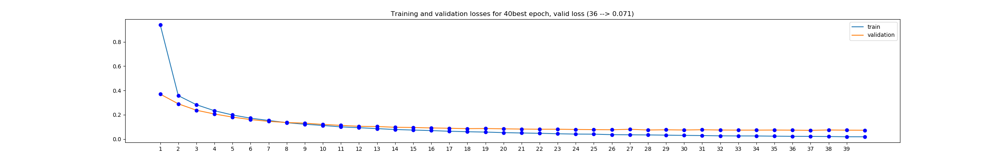

# Useful Links

Transformations: https://pytorch.org/docs/stable/torchvision/transforms.html#transforms-on-torch-tensor

IMPORTANT: In artificial neural networks, hidden layers are required if and only if the data must be separated non-linearly.
(Ref: https://towardsdatascience.com/beginners-ask-how-many-hidden-layers-neurons-to-use-in-artificial-neural-networks-51466afa0d3e)

Paper for dropout: https://www.cs.toronto.edu/~hinton/absps/JMLRdropout.pdf

Activation Functions: https://cs231n.github.io/neural-networks-1/#actfun

# MLP

## Data Load: 
- Batch size is how many samples per batch to load. 
- Convert data to tensor --> transforms. 

## Flatten the images:
Mnist data set is clean and pretrained. The images are centered in 28*28 pixel grid. (The image could be anaywhere on the grid
or the grid sizes could be different, this would be more challenging for MLP.)

We first need to convert the image to a vector. MLP uses this simple vector as input. So MLP losses the knowledge that 
the input is originally a grid.  

## Network: 

- Define architecture of the network
   - Decide number of layers and units in each layer. There is no one answer for this. 
   
## Loss:
- Define Loss and optimization
   - Cross entropy loss is a combination of Logsoftmax + NLLoss.
   - It takes the output, calculate the logsoftmax, then apply NLLoss.
   - The losses are averaged across observations for each minibatch. For example if a batch contains 20 images; 
   return loss will be average loss over 20 images.
   - If you would like to calculate the loss in each epoch, you can add the loss*batch_size to the epoch loss.

I wrote a simple code in order to understand log_softmax, softmax and related loss functions. Reach the code [here](https://github.com/pelinbalci/aws_machine_learning/blob/master/Intro_Pytorch/Intro_NN/intro_codes/loss_explanation.py)
And if you are used to using excel, a simple example is[here](https://github.com/pelinbalci/Intro_Deep_Learning/blob/master/CNN/notes/cross_entropy_example.xlsx)

## Optimization:
- I've tried Adam and SGD; you can find the results and images of each models: [Adam](images/Adam_20) and [SGD](images/SGD_20)

SGD has better test and training losses for 20 epochs:

Adam:

    Total time: 322.621 seconds
    Training loss: 8.822
    Test Loss: 0.420031
    Test Accuracy (Overall): 92% (9286/10000)

SGD: 

    Total time: 118.666 seconds
    Training loss: 0.987
    Test Loss: 0.063526
    Test Accuracy (Overall): 98% (9803/10000)
    
Remember how we use optimization. By the gradient of the loss function `loss.backwards()`, we update the weight `optimization.step()`

Don't forget to zero the gradients in each batch. 

## Training and Validation 

Training loop continues given number of epochs. Epochs are how many times we want the model to iterate through entire dataset.
One epoch sees every training image just once. We can calculate the loss in each batch and each epoch. 

It is important to decide the number of epochs. And it is science =) We will use validation. 

The steps:

- Download train and test data as usual. 
- Define validation percentage (ex: %20)
- Find the train indices. Shuffle them.  
- Split the first %20 to train_idx and rest to validation_idx
- Convert them to sampler object with SubsetRandomSampler. [code](https://github.com/pelinbalci/Intro_Deep_Learning/blob/master/CNN/codes/Sampler.py)
- Load the train, validation data with additional argument: sampler=train_sampler
 
- Train the model on training set, update the weights just by looking the training set. 
In each epoch; calculate both training and validation loss. 
    
        Prepare the model for training: `model.train()`
        Prepare the model for evaluation: `model.eval()`
        
- Validation part checks how well the model generalizes. 

- In each epoch check whether the validation loss is decreasing. If so, save the model. 
- If the validation loss increasing it means that we begin to memorize the training data and our model is overfitting to training data.
- We can stop saving the model when the validation loss stop decreasing.
- We will use the final model to calculate the test accuracy. 

It is not very clear, but the validtion loss stop decreasing in 38th epoch. 
It is not important that the validation loss is bigger than the training loss. 

***********************

Validation Set: Takeaways
We create a validation set to:

- Measure how well a model generalizes, during training
- Tell us when to stop training a model; when the validation loss stops decreasing (and especially when the validation
loss starts increasing and the training loss is still decreasing)
 
***********************

### Why don't we use test data for calculating the right epoch number?

The idea is that when we calculate the test accuracy, the model looks at the data that it has NEVER seen before. 

Although the model doesn't use validation set to update its weights, model selection process is based on how the model 
perform on both training and validation sets. Validation is part of selecting the best model. 

`The model is biased in favor of the validation set.`

Therefore we need a test set which the model hasn't seen before in order to understand how the selected model generalizes
and performs on new data.

## Test Accuracy

We need to calculate both test accuracy and test loss. 

    Accuracy = correct predictions / total predictions

Remember that: output = model(data) gives the output of Linear function or LogSoftmax function. 
[validation_code](https://github.com/pelinbalci/Intro_Deep_Learning/blob/master/CNN/codes/2_Mnist_MLP_validation.py)
uses linear function at the output layer. 

We need to find the class from this raw output: 

    # convert output probabilities to predicted class
    _, pred = torch.max(output, 1)
    
    # compare predictions to true label
    correct = np.squeeze(pred.eq(target.data.view_as(pred)))

Example:

Output[1]: [ 2.4261, -1.9679,  7.8361,  3.3351, -7.2800,  2.3091,  3.4550, -6.3603, 2.3182, -6.2720]

- There are 10 outputs for each class (0, ..9)
- len(output) = 20 since we have 20 images in each batch. 
- The max result in this example is 7.8361. It should be 2.

torch.max(output, 1) values: [ 8.7170,  7.8361,  5.9475, 10.8592,  5.4732,  7.0519,  6.2715,  5.3606,
         6.4173,  8.5225,  8.7824,  4.4948,  7.4992,  8.7843,  8.6614,  4.2144,
         6.9012,  9.0862,  4.2578,  6.7917]
         
torch.max(output, 1) pred: tensor([7, 2, 1, 0, 4, 1, 4, 9, 6, 9, 0, 6, 9, 0, 1, 5, 9, 7, 3, 4])
         
- There are 20 max values. Each of them gives us relative class.

correct = np.squeeze(pred.eq(target.data.view_as(pred)))
correct = [ True,  True,  True,  True,  True,  True,  True,  True, False,  True,
         True,  True,  True,  True,  True,  True,  True,  True,  True,  True]
         
- When we compare them to `target` we achive a boolean values. 

We can calculate:
- Total accuracy 
- Class accuracy 
    
    
## Test accuracy - 2

If we use Log softmax for the outout layer, calculating accuracy is a bit different. 
Example code is [here](https://github.com/pelinbalci/Intro_Deep_Learning/blob/master/Intro_Pytorch_Lecture/codes/15_apply_validation.py)

Here we calculate the probability by using torch.exp.

Remember this example:

Output: [2,1,0] turn these outputs to probability:

    softmax: e^x1 / e^(x1+x2+..+xn):  [0.665, 0.244, 0.090]
    logsoftmax: log(e^x1 / e^(x1+x2+..+xn)): [-0.407, -1.407, -2.407]
    exp(logsoftmax): exp(log(e^x1 / e^(x1+x2+..+xn))): [0.665, 0.244, 0.090]

torch.exp will give use probabilities. We can select the class which has maximum probability with topk.
  
    probability of the output
    ps = torch.exp(output)

    # top probabilities and classes
    top_p, top_class = ps.topk(1, dim=1)

    # compare the predictions and labels
    equals = top_class == labels.view(*top_class.shape)

    # calculate accuracy
    accuracy += torch.mean(equals.type(torch.FloatTensor))

Or after calculating ps = torch.exp(output); we can use the method above. 

