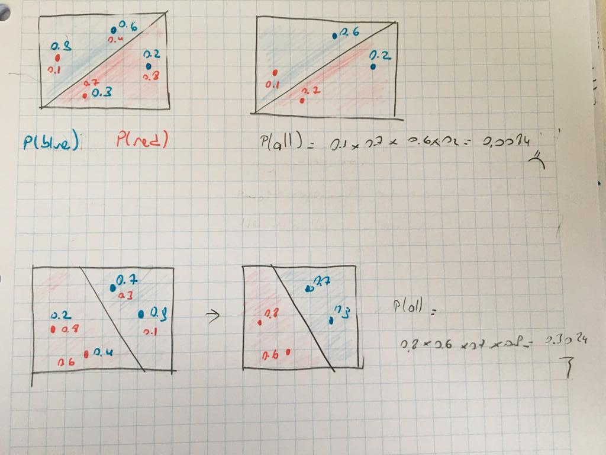
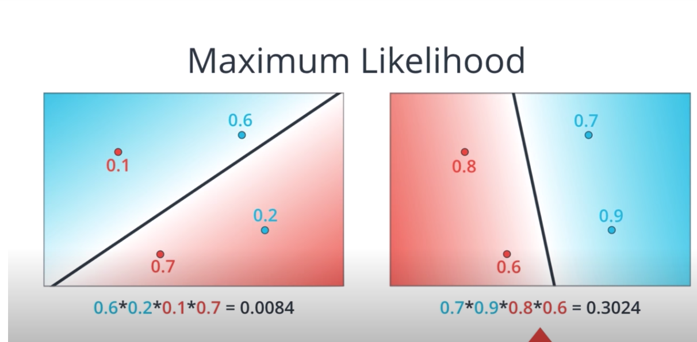
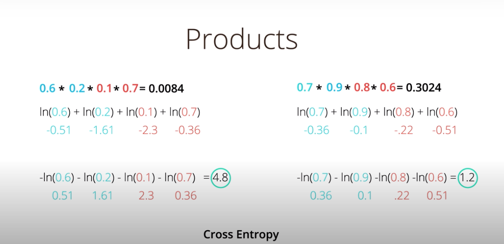
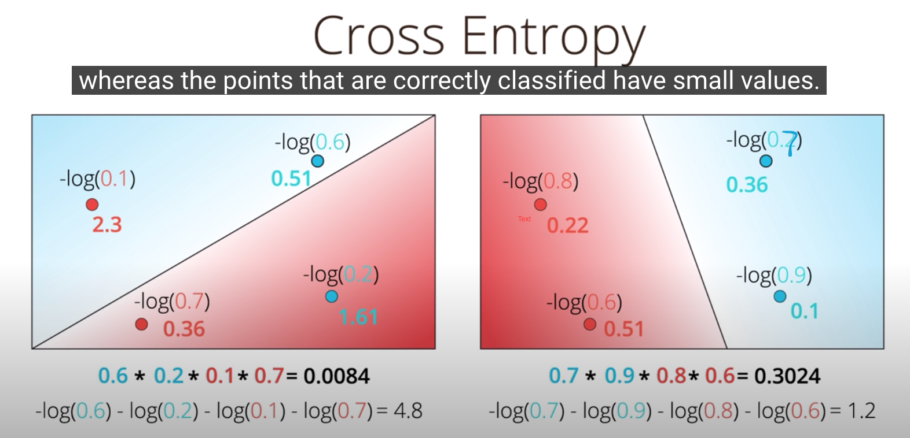
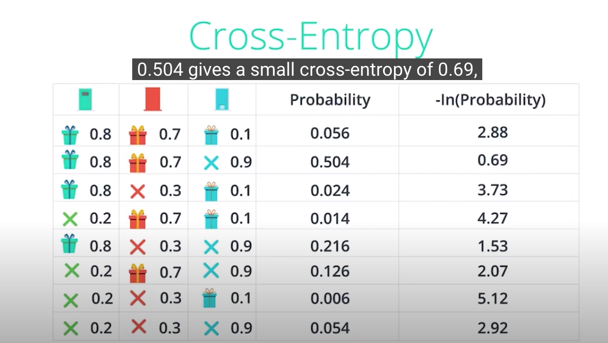
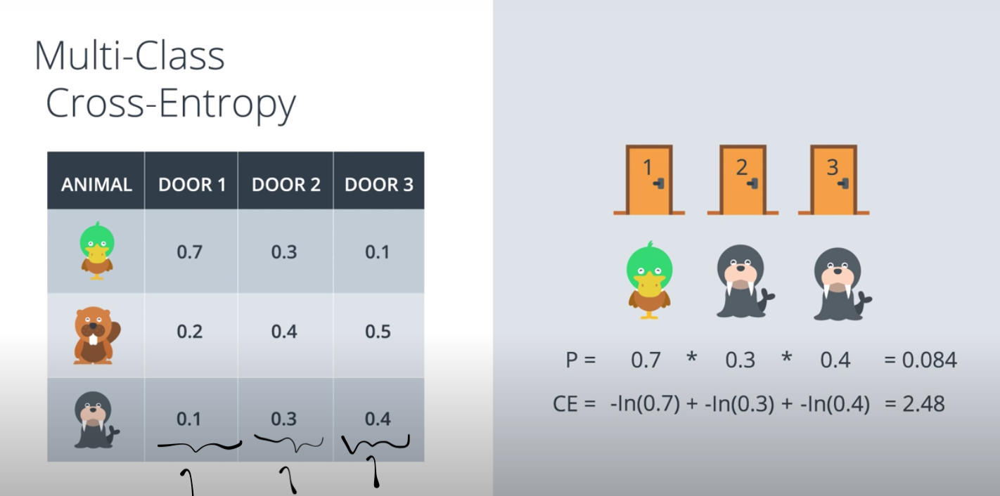
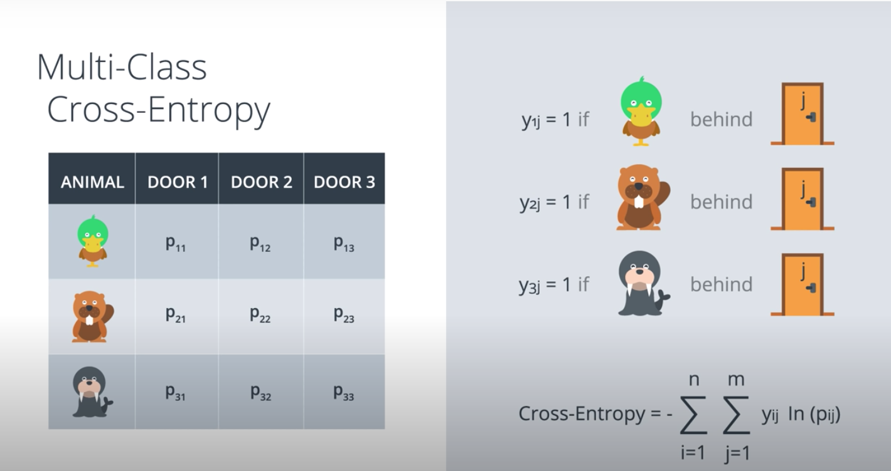

## Maximum Likelihood

We pick the model that gives the existing labels the highest probability.

Thus, maximizing the probability we can pick the best possible model.

### How to maximize the probability?

Maximizing the probability = Minimizing the error function

Products are hard to calculate :(

Sums are good :)

    What function turns products into sums?
    
    log(ab) = log(a) + log(b)
    

## Cross Entropy

As you see above, the natural logarithm of the number btw 0-1 always gives negative number. 

ln(0.6) = a

e^a = 0.6

a should be negative --> 1/ e^-a gives a number btw 0-1.

that's why; we'll take the negative of the logarithm of probabilities.

    Cross Entropy = Sum of the negative of the logarithm of probabilities
    

The good model has the cross entropy is 1.2, while the bad model has the cross entropy 4.8.

GOOD MODEL WILL GIVE US LOW CROSS ENTROPY.

IT MAKES SENSE. 

A GOOD MODEL HAVE HIGH PROBABLITY FOR THE RIGHT CLASSIFIED POINTS. 
NEGATIVE LOGARITM OF A HIGH NUMBER WILL BE LOW. 

    if the probability of a point is 1;
    
    ln(1) = 0 
    

   
We can think of the negative of the logarithms of probabilities as ERRORS for each point.

Points that are correctly classified will have small errors and o.w they have large errors. 

Maximizing the probability = Minizing the Cross Entropy

### Cross Entropy formula

The probabilities of the gift behind the door 1,2 and 3 are:

- p1 = 0.8
- p2= 0.7
- p3 = 0.1 

Is there a gift behind the doors? Observed values: 

- y1 = 1 (there is a gift behind the door 1)
- y2 = 1 (there is a gift behind the door 2)
- y3 = 0 (no gift behind the door 3)

let's calculate the cross entropy:

    -ln(p1) -ln(p2) - ln(1-p3)

The reason that we calculate the 1-p3 is that the observed value of door 3 is no gift. 
According to the observed value, probability of no gift behind the door 3 is 0.9. 

    cross entropy = - Sum over(i = 1..m) yi * ln(pi) + (1-yi) * ln(1-pi)

.

    for i =1:
        if y1 = 1:
            The second part becomes 0. We only calculate the first part. 
            
        else:
            The first part becomes 0. And we calculate the second part with 1-p
  

[cross_entropy_code](https://github.com/pelinbalci/Intro_Deep_Learning/blob/master/Intro_NN/intro_codes/cross_entropy.py)

### Multiclass Cross Entropy

More generic formula: 

