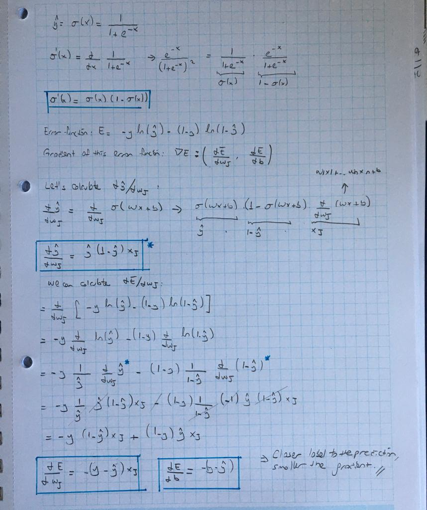

[Gradient_descent_code](https://github.com/pelinbalci/Intro_Deep_Learning/blob/master/Intro_NN/intro_codes/gradient_descent.py)

## Perceptron vs Gradient Descent

In Gradient descent algorithm we change every weights with the gradient * learning rate.
y' can be anything between 0 and 1. 

In perceptron algorithm NOT every point changes weights, only the misclassified ones.
In perceptron algorithm, the labels are 1 and 0 and our predictions are 1 or 0.

    If  x is correctly classified: 
    
        y = 1 and y' = 1 or
        y = 0 and y' = 0 
        difference is 0
    
    If  x is misclassified: 
    
        y = 1 and y' = 0 --> difference =1
        y = 0 and y' = 1 --> difference = -1
    

    If x is misclassified: 

        wi = wi + learning rate * xi, if the point label is positive.      
        wi = wi - learning rate * xi, if the point label is negative.
        
