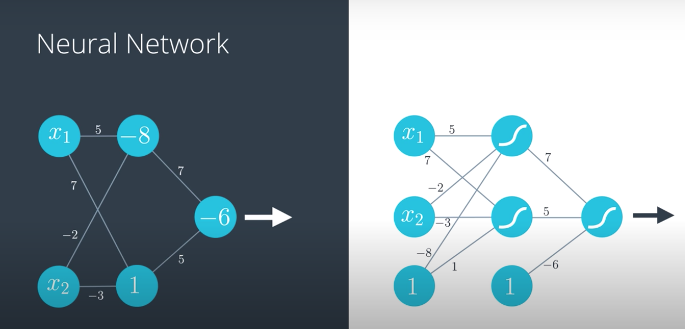
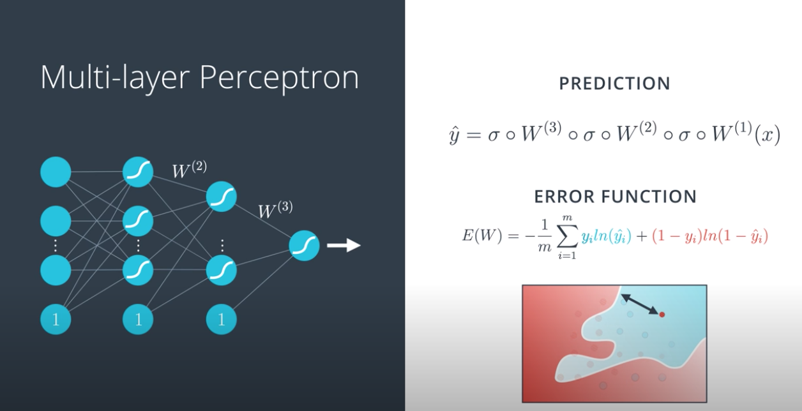
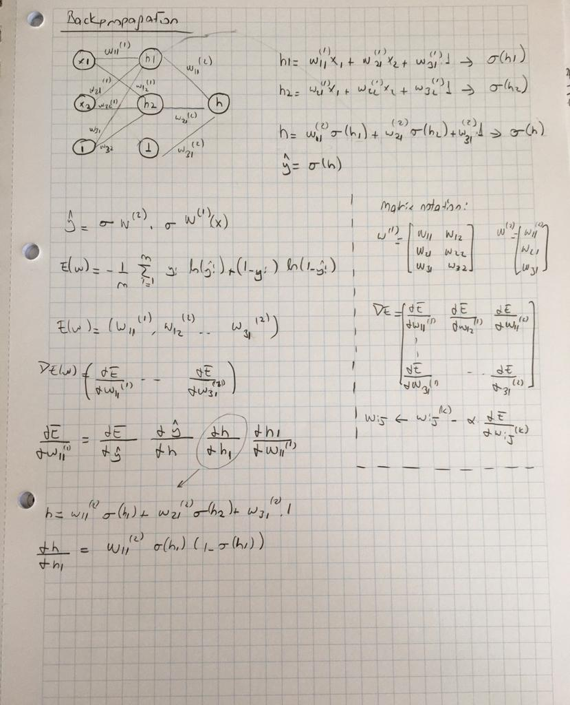
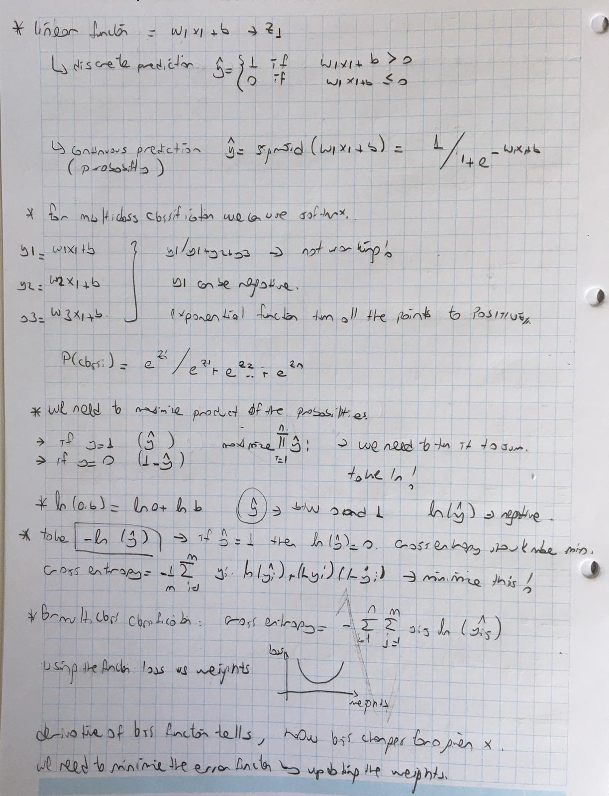
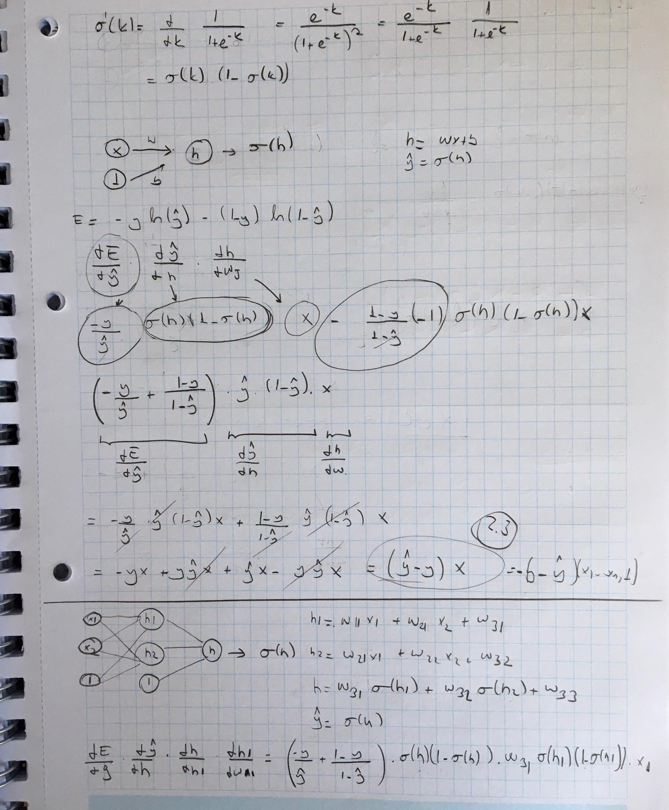

Example-1:
A linear model is a probability space. 

It gives us the probability of being blue (class 1, positive class) for every point.

In one prob. space a point has a prob = 0.8 of being blue. 
In second prob. space ıt has a prob of being blue = 0.7 

How can we combine them?

Summarize? 

0.8 + 0.7 = 1.5 :( It's not btw 0-1 . 

    We can use sigmoid function --> sigmoid(p1 + p2)

sigmoid(0.8 + 0.7) = 0.82

    we can weight the probabilities ---> sigmoid(w1*p1 + w2*p2 + b)
    
sigmoid(7 * 0.7 + 5 * 0.8 -6) = sigmoid(2.9) = 0.95

Example-2:

- 1st linear model = 5x1 - 2x2 + 8 
- 2nd linear model = 7x1 - 3x2 + 1
- Combine the outputs with the weights; 7 and 5 and use bias as -6.

from the first linear model we need to calculate a probability, so we need to use sigmoid function for it. 

- sigmoid(5x1 - 2x2 + 8)) --> prob of first model for the point x1, x2 --> a
- sigmoid(7x1 - 3x2 + 1)) --> prob of second model for the point x1, x2 ---> b

we can use a and b directly. 

if the combination model is 7a + 5b -6, we need to use sigmoid again;

sigmoid(7a + 5b -6) ---> output probability. 

 

this image shows that:

- the first layer is input layer. 
- the second layer is hidden layer. There are activation functions like sigmoid.
- the third layer is output layer. There is another activation function and we find the final probability. 

## Multiclass classification

We want a model that shows us an image is a dog, a cat or a bear. 

We don't need to create 3 different models. We just need to add 3 activation functions at the output layer. 

Question: How many nodes in the output layer would you require if you were trying to classify all the letters in the English alphabet?
Answert: 26

## Feedforward

Feedforward is the process neural networks use to turn the input into an output

y' = &sigma; * W(2) *  &sigma; * W(1) * x

## Error Function

## Backpropagation

Ref: http://www.ashukumar27.io/LogisticRegression-Backpropagation/
Ref: https://stats.stackexchange.com/questions/370723/how-to-calculate-the-derivative-of-crossentropy-error-function
Ref: https://mc.ai/derivation-of-back-propagation-with-cross-entropy/
Ref: https://medium.com/@pchetan481/derivation-of-back-propagation-with-cross-entropy-7ac0f63c8c28

- Doing a feedforward operation.
- Comparing the output of the model with the desired output.
- Calculating the error.
- Running the feedforward operation backwards (backpropagation) to spread the error to each of the weights.
- Use this to update the weights, and get a better model.
- Continue this until we have a model that is good. 

## Summary

