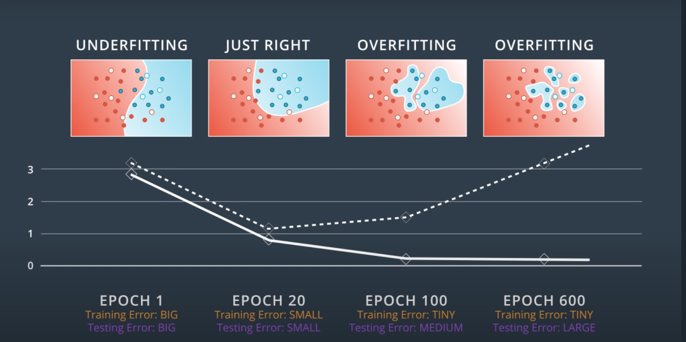
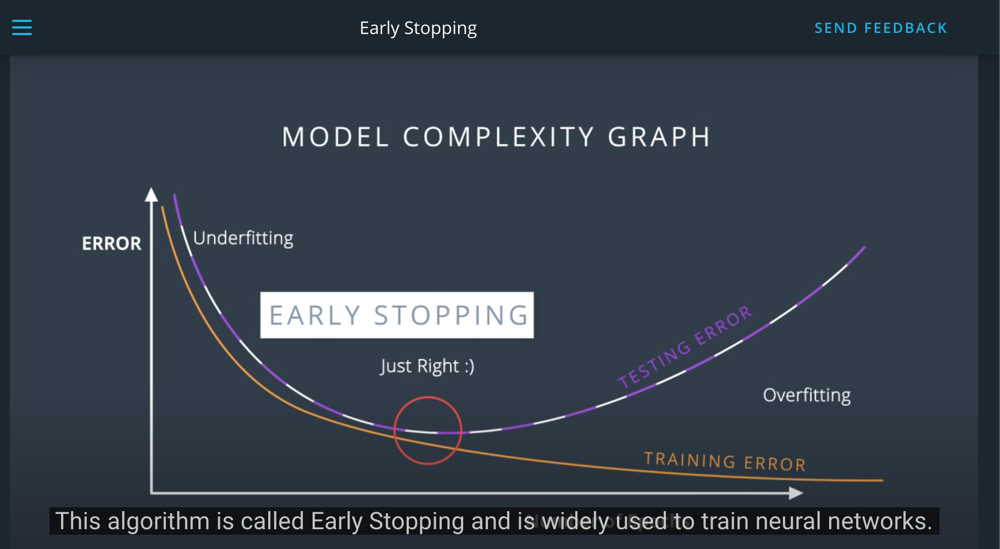
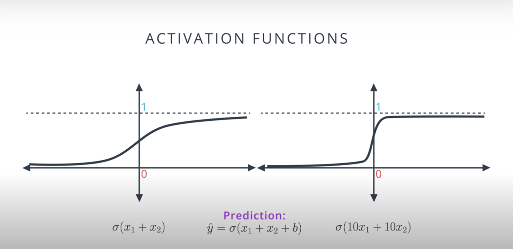
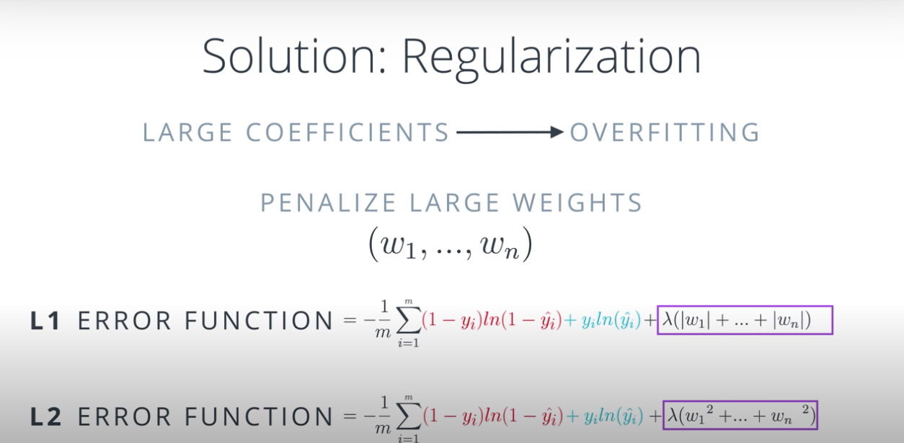
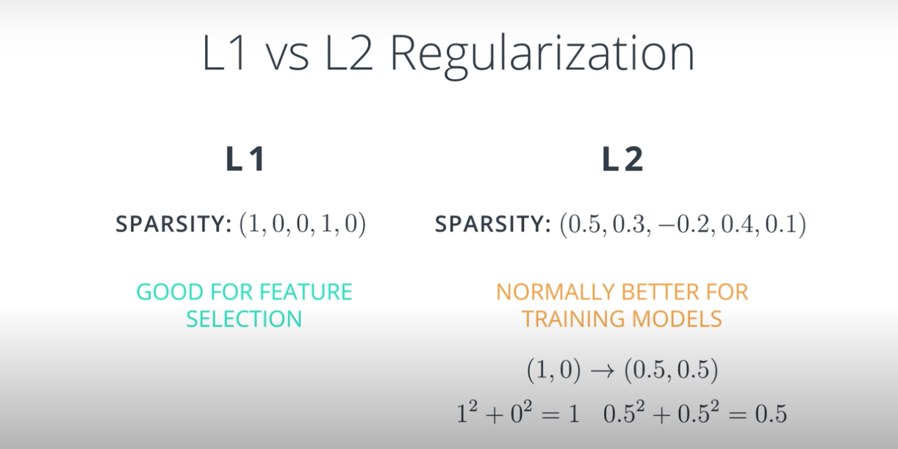

## Prevent overfitting:

1. Early Stopping
2. Regularization
3. Dropout

## Early Stopping

## Regularization

#### Example:

We have two points: (1,1) and (-1,-1)

To separate them; which line would be best? i.e which linegives a smaller error?

- x1 + x2
- 10x1 + 10x2

#### Solution:

Both equation gives us the same line.  

How can we make a prediction with these lines?

y_pred_1 = sigmoid(x1 + x2) or y_pred_2 = (10x1 + 10x2)

Let's calculate the probability of these two numbers:

    y_pred_1 = sigmoid(1+1), sigmoid(-1,-1)
    y_pred_1 = (0.88, 0.12)
    
    y_pred_2 = sigmoid(10 * 1 + 10 * 1), igmoid(10 * -1 + 10 * -1)
    y_pred_2 = (0.99, 0.00002)

Answer: 10x1 + 10x2

#### Explanation: 

sigmoid(10x1 + 10x2) function:
 
- our predictions are better since they are closer to 0 and 1.
- much stepper than sigmoid(x1 + x2)
- much harder to do gradient descent. 
- derivatives are mostly close to zero and very large when we get to the middle of the curve. 
- too certain to apply gradient descent.
- the points that are incorrectly classified in the model will generate large errors.

`The whole problem with AI is that bad models are so certain of themselves and good models so full of doubts. BertrAIND Russel`

#### Problem:

LARGE Coefficients give SMALLER errors. But they cause OVERFITTING.

We have to TWEAK the ERROR function. 

 ---> We will punish high coefficients. <---

### Deciding between L1 and L2:

If you want to reduce the number of weights i.e. want more sparsity (1,0,0,1,0), you can use L1. 
You will end up with a small set. (if you have a hundreds of vectors)

L2 tries to maintain all the weights homogeneously small. It gives better results.

### Homogeneously small? How?

take the vector (1, 0):

    L1: |w1| + |w2|
        1 + 0 = 1
     
    L2: W1^2 + W2^2
        1^2 + 0^2 = 1

take the vector (0.5, 0.5):

    L1: |w1| + |w2|
        0.5 + 0.5 = 1
     
    L2: W1^2 + W2^2
        0.5^2 + 0.5^2 = 0.25

L2 will prefer vector (0.5, 0.5) over (1, 0)

## Dropout

One neuron may have very large weights and dominate the training process. 

Turned the over trained part and let rest of the network train

Example: 
- In the first epoch, dropout one node. 
- In the second epoch, dropout another two nodes. 
- In the second epoch, dropout another one node.

Probability of each node will be dropped is 0.2   
