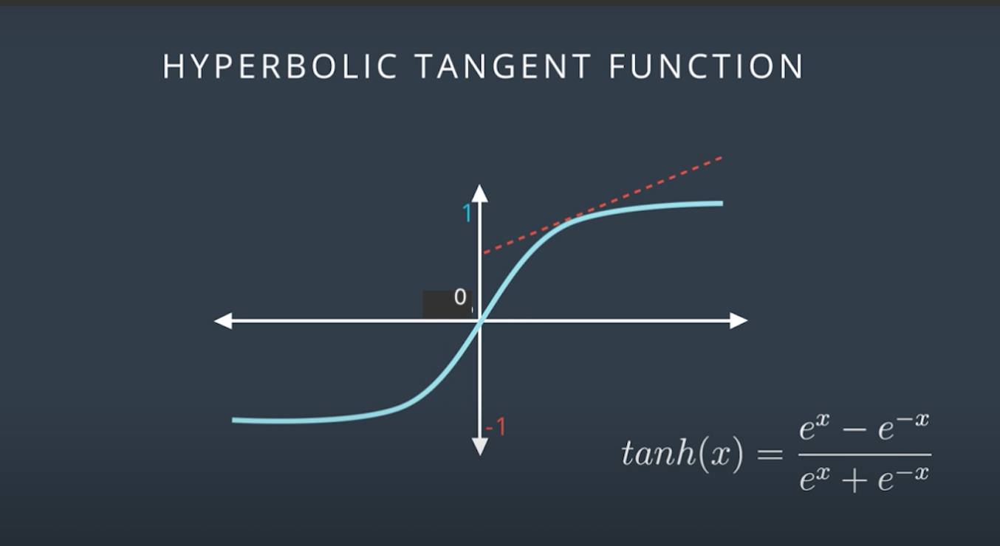
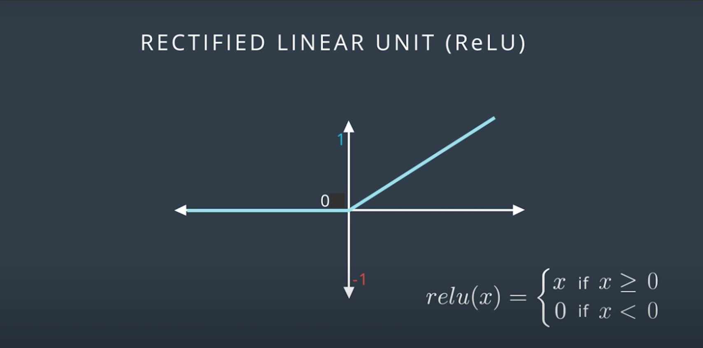

## Local Minima, Random Starts

When we stuck in the local minima; gradient descent doesn't help us. 

Solutions is Random Starts.

Start from few different random places and do gradient descent from all of them.

This method increases the probability that we'll get the global or a good local minimum.

## Vanishing Gradient 

Derivative of sigmoid function at the right or left gives us almost 0.

Moreover; for multilayer perceptrons; 
the derivative is the product of derivative of sigmoid functions. --> we get tiny numbers for backpropagation. 

It becomes impossible to move in the loss function.

One solution is Changing the Activation Function. 

Hyperbolic Tangent

    tanh(x) = e^x - e^-x / e^x + e^-x

The range is between -1 and 1. ---> The derivative is larger. 

Rectified Linear Unit 

    relu(x) = { x if x>=0
                0 if x<0

Derivative is 1, if the number is positive. 

If you use relu in hidden layers, the output layer should be still sigmoid function since the output must be probability. 

Recurring Neural Network: If you use relu in the output layer, yo can end up with regression models, predictive value.

## Batch vs Stochastic Gradient Descent

Batch :

In the first epoch:

- Start with random weights. 
- Take all the data.
- Run them through entire neural network. 
- Make predictions.
- Calculate error for all data point. Take average of them. 
- Back-propagate and Find gradient.
- Update weights. 
    
In the second epoch:
- Use updated weights. 
- Take all data. 
    ....
    
    
It need many many computations. 

If our data is well distributed, may be a small set of data enough--> Stochastic gradient descent.    

Example:

You have 24 points. You can split them in the 4. 

In each iteration, you can take 6 points and update the weights. 
In the normal gradient descent you will use them all in one iteration. 

## Learning Rate

If your model is not working, decrease the learning rate.

## Momentum

When you stuck in local minimum, then you would like to take a big step. 

It can be average of previous ten steps. 

but it could be great if we can weight the steps. Use Momentum. 

&Beta; --> Momentum. the range is: [0,1]

Step = step(n) + &Beta; * step(n-1) + &Beta;^2* step(n-2) + ...

