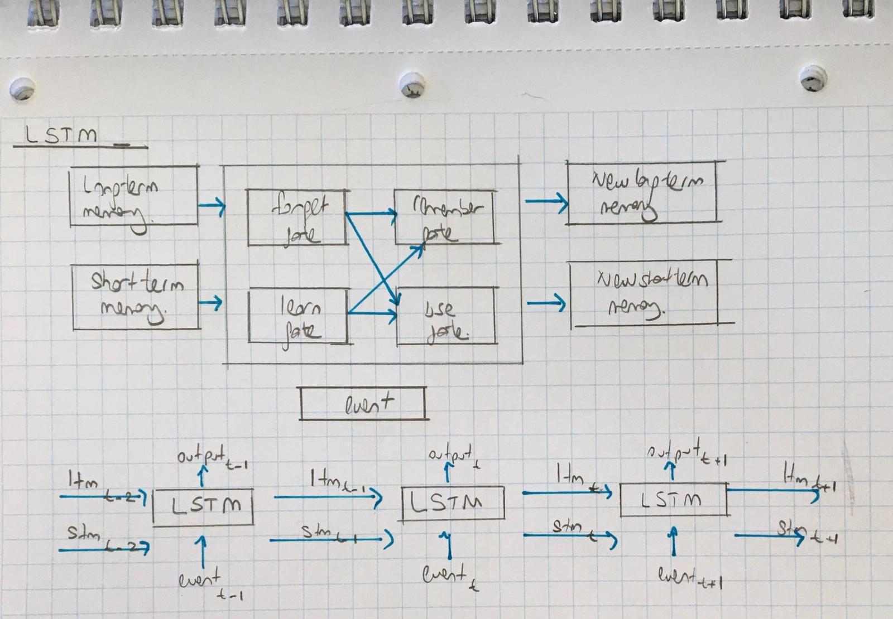
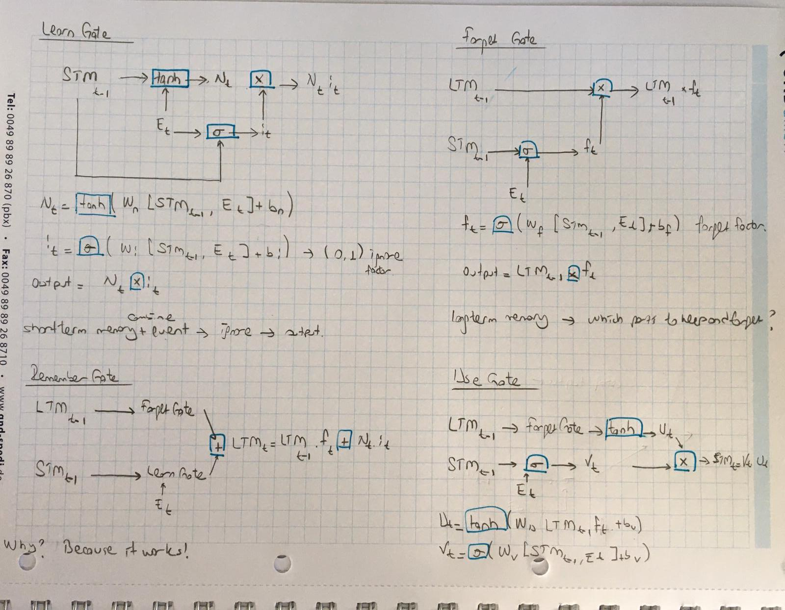

# Recurrent Neural Networks - RNN

### Outline:

- Simple models: [Simple_RNN](Simple_RNN.py), [Simple_RNN_cont](Simple_RNN_cont.py)
- [Time Series Analysis](RNN_time_series.py) and [Results](results_time_series.md), [input_data](time_series_df.csv)
- Karpathy example for simple text: [input data](input.txt), [karpathy_rnn](karpathy_rnn.py), [karpathy_rnn_complete](karpathy_rnn_complete.py)
- Complete example for text data: [Char_RNN](Char_RNN.py), [Char_RNN_2](Char_RNN_2.py)

Ref: https://classroom.udacity.com/courses/ud188/lessons/a8fc0724-37ed-40d9-a226-57175b8bb8cc/concepts/e0568d87-96f4-4270-8552-22dc05a1e4f4

RNNs are designed specifically to learn from sequences of data by passing the hidden state from one step in the sequence 
to the next step in the sequence, combined with the input. LSTMs are an improvement the RNNs, and are quite useful when 
our neural network needs to switch between remembering recent things, and things from long time ago. 

# Resources

- http://colah.github.io/posts/2015-08-Understanding-LSTMs/
- http://blog.echen.me/2017/05/30/exploring-lstms/
- http://karpathy.github.io/2015/05/21/rnn-effectiveness/
- https://www.youtube.com/watch?v=iX5V1WpxxkY

# Problem

- We have a long term memory that the tv show is about nature & science and lots of forrest animals have appeared.
- We have a short term memory that we 've seen squirrels and trees.
- And we a current event that we've just seen --> it can be a dog or a wolf.

We want to make a prediction using these three inputs:
- Event
- Long term memory
- Short term memory  

Output:

- P(dog) = 0.2
- P(wolf) = 0.8

- Update the long term memory: Show about Nature, Lots of forest animals and trees.
- Update the short term memory: Wolves and squirrels.

# How?

LSTM have four gates:

    - Forget gate  --> long term memory
    - Learn gate  --> short term memory + event
    
    - Remember Gate  --> forget date + learn gate  ---> new long term memory
    - Use Gate  --> forget gate + stm  ---> new short term memory

# Code

Define RNN

- input_size: the size of the input we have 1 feature --> x
- hidden_dim: the number of features in the RNN output and in the hidden state
- n_layers: the number of layers that make up the RNN, typically 1-3; greater than 1 means that you'll create a stacked RNN
- batch_first:  whether or not the input/output of the RNN will have the batch_size as the first dimension 
(batch_size, seq_length, hidden_dim)
- batch_first=True : means that the first dimension of the input and output will be the batchsize. 
- batch_first=True : shaping the input such that the batch size will be the first dimension. 

### Shape

- Input: torch.Size([1, 20, 1]) 
 
 
        batch_size=1, 
        seq_length = 20, 
        input number of features = 1
        
- Output: torch.Size([20, 1])  
        
        
        batch_size*seq=20, 
        output_size=1
        
- Hidden: torch.Size([2, 1, 10])  
        
        
        n_layers=2, 
        batch_size =1, 
        hidden_dim=10

QUIZ:

Say you've defined a GRU layer with:
 - input_size = 100, 
 - hidden_size = 20, 
 - num_layers=1
 
What will the dimensions of the hidden state be if you're passing in data, batch first, in batches of 3 sequences at a time?

ANSWER: (1,3,20)

