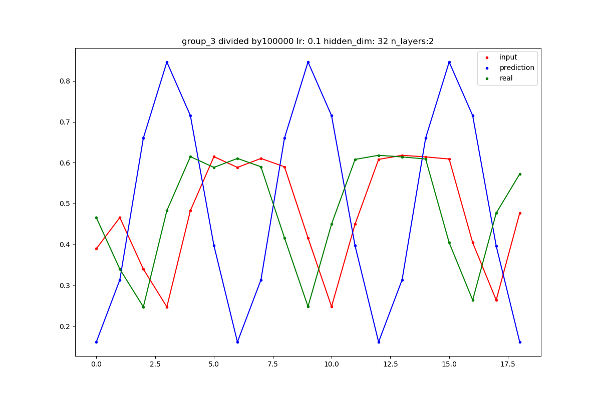

# Group_7:

decide on hyperparameters for construct RNN:

    input_size = 1
    output_size = 1
    hidden_dim = 16
    n_layers = 2
    lr = 0.01
    divide = 1000

train the rnn and monitor results:
    
    iterations = 1500
    print_every = 100

/Users/pelin.balci/.conda/envs/Intro_Pytorch/bin/python /Users/pelin.balci/PycharmProjects/Intro_Deep_Learning/RNN/RNN_time_series.py
RNN(
  (rnn): RNN(1, 16, num_layers=2, batch_first=True)
  (fc): Linear(in_features=16, out_features=1, bias=True)
)

    batch_i: 0, Loss: 372.0562744140625
    batch_i: 100, Loss: 27.519428253173828
    batch_i: 200, Loss: 11.920400619506836
    batch_i: 300, Loss: 11.84985065460205
    batch_i: 400, Loss: 11.849832534790039
    batch_i: 500, Loss: 11.849822044372559
    batch_i: 600, Loss: 11.849809646606445
    batch_i: 700, Loss: 11.849793434143066
    batch_i: 800, Loss: 11.849771499633789
    batch_i: 900, Loss: 11.844079971313477
    batch_i: 1000, Loss: 2.739037036895752
    batch_i: 1100, Loss: 0.7407514452934265
    batch_i: 1200, Loss: 0.39862382411956787
    batch_i: 1300, Loss: 0.09928129613399506
    batch_i: 1400, Loss: 0.06925696134567261

# Group_6:

decide on hyperparameters for construct RNN:

    input_size = 1
    output_size = 1
    hidden_dim = 32
    n_layers = 2
    lr = 0.1
    divide = 100000

train the rnn and monitor results:

    iterations = 2000
    print_every = 100

/Users/pelin.balci/.conda/envs/Intro_Pytorch/bin/python /Users/pelin.balci/PycharmProjects/Intro_Deep_Learning/RNN/RNN_time_series.py
RNN(
  (rnn): RNN(1, 32, num_layers=2, batch_first=True)
  (fc): Linear(in_features=32, out_features=1, bias=True)
)

    batch_i: 0, Loss: 2.0992531776428223
    batch_i: 100, Loss: 0.09729369729757309
    batch_i: 200, Loss: 0.09373041242361069
    batch_i: 300, Loss: 0.10694097727537155
    batch_i: 400, Loss: 0.12399862706661224
    batch_i: 500, Loss: 0.13614322245121002
    batch_i: 600, Loss: 0.059748150408267975
    batch_i: 700, Loss: 0.05472103878855705
    batch_i: 800, Loss: 0.05534404516220093
    batch_i: 900, Loss: 0.05344567447900772
    batch_i: 1000, Loss: 0.05112604796886444
    batch_i: 1100, Loss: 0.05037678778171539
    batch_i: 1200, Loss: 0.04999160021543503
    batch_i: 1300, Loss: 0.04992809519171715
    batch_i: 1400, Loss: 0.0499354749917984
    batch_i: 1500, Loss: 0.049829158931970596
    batch_i: 1600, Loss: 0.0490773469209671
    batch_i: 1700, Loss: 0.04966256767511368
    batch_i: 1800, Loss: 0.049820445477962494
    batch_i: 1900, Loss: 0.04994450509548187

# Group_5

decide on hyperparameters for construct RNN: 

    group = 'group_5'
    
    input_size = 1
    output_size = 1
    hidden_dim = 16
    n_layers = 2
    lr = 0.01
    divide = 100000

train the rnn and monitor results:

    iterations = 2000
    print_every = 100

/Users/pelin.balci/.conda/envs/Intro_Pytorch/bin/python /Users/pelin.balci/PycharmProjects/Intro_Deep_Learning/RNN/RNN_time_series.py
RNN(
  (rnn): RNN(1, 16, num_layers=2, batch_first=True)
  (fc): Linear(in_features=16, out_features=1, bias=True)
)

    batch_i: 0, Loss: 33.145206451416016
    batch_i: 100, Loss: 3.0330567359924316
    batch_i: 200, Loss: 3.032127857208252
    batch_i: 300, Loss: 2.90295147895813
    batch_i: 400, Loss: 0.9479672908782959
    batch_i: 500, Loss: 0.10297631472349167
    batch_i: 600, Loss: 0.08234105259180069
    batch_i: 700, Loss: 0.07497155666351318
    batch_i: 800, Loss: 0.0714164450764656
    batch_i: 900, Loss: 0.06938790529966354
    batch_i: 1000, Loss: 0.0733608677983284
    batch_i: 1100, Loss: 0.06767243146896362
    batch_i: 1200, Loss: 0.0670442059636116
    batch_i: 1300, Loss: 0.06678607314825058
    batch_i: 1400, Loss: 0.0666256844997406
    batch_i: 1500, Loss: 0.0665273517370224
    batch_i: 1600, Loss: 0.06645333021879196
    batch_i: 1700, Loss: 0.06636807322502136
    batch_i: 1800, Loss: 0.06600047647953033
    batch_i: 1900, Loss: 0.06469357758760452
    rnn is completed

decide on hyperparameters for construct RNN: 

    group = 'group_5'
    
    input_size = 1
    output_size = 1
    hidden_dim = 16
    n_layers = 2
    lr = 0.01
    divide = 10000

train the rnn and monitor results:

    iterations = 2000
    print_every = 100

/Users/pelin.balci/.conda/envs/Intro_Pytorch/bin/python /Users/pelin.balci/PycharmProjects/Intro_Deep_Learning/RNN/RNN_time_series.py
RNN(
  (rnn): RNN(1, 16, num_layers=2, batch_first=True)
  (fc): Linear(in_features=16, out_features=1, bias=True)
)

    batch_i: 0, Loss: 3207.479248046875
    batch_i: 100, Loss: 1623.73388671875
    batch_i: 200, Loss: 843.9266967773438
    batch_i: 300, Loss: 490.6865539550781
    batch_i: 400, Loss: 357.0484619140625
    batch_i: 500, Loss: 315.8841857910156
    batch_i: 600, Loss: 305.6807861328125
    batch_i: 700, Loss: 303.6539611816406
    batch_i: 800, Loss: 303.3319396972656
    batch_i: 900, Loss: 303.2911682128906
    batch_i: 1000, Loss: 303.2870178222656
    batch_i: 1100, Loss: 303.2867126464844
    batch_i: 1200, Loss: 303.28668212890625
    batch_i: 1300, Loss: 303.28668212890625
    batch_i: 1400, Loss: 303.2865905761719
    batch_i: 1500, Loss: 303.28656005859375
    batch_i: 1600, Loss: 303.2759094238281
    batch_i: 1700, Loss: 181.3680419921875
    batch_i: 1800, Loss: 64.7673568725586
    batch_i: 1900, Loss: 60.01142120361328
    rnn is completed

# Group_4

decide on hyperparameters for construct RNN:

    group = 'group_4'
    
    input_size = 1
    output_size = 1
    hidden_dim = 16
    n_layers = 2
    lr = 0.01
    divide = 100000

train the rnn and monitor results:

    iterations = 2000
    print_every = 100

/Users/pelin.balci/.conda/envs/Intro_Pytorch/bin/python /Users/pelin.balci/PycharmProjects/Intro_Deep_Learning/RNN/RNN_time_series.py
RNN(
  (rnn): RNN(1, 16, num_layers=2, batch_first=True)
  (fc): Linear(in_features=16, out_features=1, bias=True)
)

    batch_i: 0, Loss: 266.2640075683594
    batch_i: 100, Loss: 19.92589569091797
    batch_i: 200, Loss: 16.358797073364258
    batch_i: 300, Loss: 16.35760498046875
    batch_i: 400, Loss: 16.35697364807129
    batch_i: 500, Loss: 16.3537540435791
    batch_i: 600, Loss: 3.6548805236816406
    batch_i: 700, Loss: 1.2573362588882446
    batch_i: 800, Loss: 0.6301722526550293
    batch_i: 900, Loss: 0.45462173223495483
    batch_i: 1000, Loss: 0.2565344572067261
    batch_i: 1100, Loss: 0.17910264432430267
    batch_i: 1200, Loss: 0.13757416605949402
    batch_i: 1300, Loss: 0.10906714200973511
    batch_i: 1400, Loss: 0.08942092210054398
    batch_i: 1500, Loss: 0.0750904530286789
    batch_i: 1600, Loss: 0.06428895890712738
    batch_i: 1700, Loss: 0.0561722107231617
    batch_i: 1800, Loss: 0.05898609384894371
    batch_i: 1900, Loss: 0.045832328498363495
    rnn is completed

# Group_3

decide on hyperparameters for construct RNN:

    group = 'group_3'
    
    input_size = 1
    output_size = 1
    hidden_dim = 32
    n_layers = 2
    lr = 0.1
    divide = 100000

train the rnn and monitor results:

    iterations = 1500
    print_every = 100

/Users/pelin.balci/.conda/envs/Intro_Pytorch/bin/python /Users/pelin.balci/PycharmProjects/Intro_Deep_Learning/RNN/RNN_time_series.py
RNN(
  (rnn): RNN(1, 32, num_layers=2, batch_first=True)
  (fc): Linear(in_features=32, out_features=1, bias=True)
)

    batch_i: 0, Loss: 0.16963991522789001
    batch_i: 100, Loss: 0.03192801773548126
    batch_i: 200, Loss: 0.07358910143375397
    batch_i: 300, Loss: 0.043167226016521454
    batch_i: 400, Loss: 0.07522056996822357
    batch_i: 500, Loss: 0.10079420357942581
    batch_i: 600, Loss: 0.0730610266327858
    batch_i: 700, Loss: 0.0917147621512413
    batch_i: 800, Loss: 0.0951569601893425
    batch_i: 900, Loss: 0.08423501253128052
    batch_i: 1000, Loss: 0.0939389169216156
    batch_i: 1100, Loss: 0.11341945081949234
    batch_i: 1200, Loss: 0.05453736335039139
    batch_i: 1300, Loss: 0.0944613367319107
    batch_i: 1400, Loss: 0.10504287481307983
    rnn is completed

decide on hyperparameters for construct RNN:
    
    group = 'group_3'
    
    input_size = 1
    output_size = 1
    hidden_dim = 32
    n_layers = 2
    lr = 0.1
    divide = 100000

train the rnn and monitor results:

    iterations = 150
    print_every = 10

/Users/pelin.balci/.conda/envs/Intro_Pytorch/bin/python /Users/pelin.balci/PycharmProjects/Intro_Deep_Learning/RNN/RNN_time_series.py
RNN(
  (rnn): RNN(1, 32, num_layers=2, batch_first=True)
  (fc): Linear(in_features=32, out_features=1, bias=True)
)

    batch_i: 0, Loss: 0.2730865776538849
    batch_i: 10, Loss: 0.925391674041748
    batch_i: 20, Loss: 0.29627418518066406
    batch_i: 30, Loss: 0.033292632550001144
    batch_i: 40, Loss: 0.028427205979824066
    batch_i: 50, Loss: 0.01806720159947872
    batch_i: 60, Loss: 0.020918112248182297
    batch_i: 70, Loss: 0.017350420355796814
    batch_i: 80, Loss: 0.01714085415005684
    batch_i: 90, Loss: 0.01918135955929756
    batch_i: 100, Loss: 0.019799401983618736
    batch_i: 110, Loss: 0.02452283911406994
    batch_i: 120, Loss: 0.026791252195835114
    batch_i: 130, Loss: 0.01780422031879425
    batch_i: 140, Loss: 0.019211236387491226
    rnn is completed

decide on hyperparameters for construct RNN:

    group = 'group_3'
    
    input_size = 1
    output_size = 1
    hidden_dim = 128
    n_layers = 2
    lr = 0.1
    divide = 10000

train the rnn and monitor results:

    iterations = 1500
    print_every = 100

/Users/pelin.balci/.conda/envs/Intro_Pytorch/bin/python /Users/pelin.balci/PycharmProjects/Intro_Deep_Learning/RNN/RNN_time_series.py
RNN(
  (rnn): RNN(1, 128, num_layers=2, batch_first=True)
  (fc): Linear(in_features=128, out_features=1, bias=True)
)

    batch_i: 0, Loss: 26.77686882019043
    batch_i: 100, Loss: 2.0049991607666016
    batch_i: 200, Loss: 1.841854214668274
    batch_i: 300, Loss: 1.9744775295257568
    batch_i: 400, Loss: 2.062990188598633
    batch_i: 500, Loss: 2.1184444427490234
    batch_i: 600, Loss: 2.137822389602661
    batch_i: 700, Loss: 2.158966541290283
    batch_i: 800, Loss: 2.1710824966430664
    batch_i: 900, Loss: 2.178194761276245
    batch_i: 1000, Loss: 2.182495594024658
    batch_i: 1100, Loss: 2.185168981552124
    batch_i: 1200, Loss: 2.1868677139282227
    batch_i: 1300, Loss: 2.187955379486084
    batch_i: 1400, Loss: 2.2052106857299805
    rnn is completed

decide on hyperparameters for construct RNN:

    group = 'group_3'
    
    input_size = 1
    output_size = 1
    hidden_dim = 256
    n_layers = 2
    lr = 0.1
    divide = 10000

train the rnn and monitor results:

    iterations = 1500
    print_every = 100

/Users/pelin.balci/.conda/envs/Intro_Pytorch/bin/python /Users/pelin.balci/PycharmProjects/Intro_Deep_Learning/RNN/RNN_time_series.py
RNN(
  (rnn): RNN(1, 256, num_layers=2, batch_first=True)
  (fc): Linear(in_features=256, out_features=1, bias=True)
)

    batch_i: 0, Loss: 26.064945220947266
    batch_i: 100, Loss: 1.6954081058502197
    batch_i: 200, Loss: 1.7688305377960205
    batch_i: 300, Loss: 1.804055094718933
    batch_i: 400, Loss: 1.8458051681518555
    batch_i: 500, Loss: 1.8957054615020752
    batch_i: 600, Loss: 1.958615779876709
    batch_i: 700, Loss: 2.0460689067840576
    batch_i: 800, Loss: 2.1725382804870605
    batch_i: 900, Loss: 2.3469936847686768
    batch_i: 1000, Loss: 2.558051347732544
    batch_i: 1100, Loss: 2.764842987060547
    batch_i: 1200, Loss: 2.9233901500701904
    batch_i: 1300, Loss: 3.022141933441162
    batch_i: 1400, Loss: 3.076171636581421
    rnn is completed

# Group_2:

decide on hyperparameters for construct RNN:

    input_size = 1
    output_size = 1
    hidden_dim = 64
    n_layers = 2
    lr = 0.01
    divide = 100000

train the rnn and monitor results:

    iterations = 1500
    print_every = 100

/Users/pelin.balci/.conda/envs/Intro_Pytorch/bin/python /Users/pelin.balci/PycharmProjects/Intro_Deep_Learning/RNN/RNN_time_series.py
RNN(
  (rnn): RNN(1, 64, num_layers=2, batch_first=True)
  (fc): Linear(in_features=64, out_features=1, bias=True)
)

    batch_i: 0, Loss: 89.94036865234375
    batch_i: 100, Loss: 20.68293571472168
    batch_i: 200, Loss: 20.682029724121094
    batch_i: 300, Loss: 12.52668571472168
    batch_i: 400, Loss: 8.90975570678711
    batch_i: 500, Loss: 7.338719844818115
    batch_i: 600, Loss: 7.254549026489258
    batch_i: 700, Loss: 5.039112091064453
    batch_i: 800, Loss: 7.658030986785889
    batch_i: 900, Loss: 8.967937469482422
    batch_i: 1000, Loss: 8.816337585449219
    batch_i: 1100, Loss: 7.596029758453369
    batch_i: 1200, Loss: 7.585362434387207
    batch_i: 1300, Loss: 7.578645706176758
    batch_i: 1400, Loss: 7.286593914031982
    rnn is completed

# Group_1

decide on hyperparameters for construct RNN:
    
    input_size = 1
    output_size = 1
    hidden_dim = 64
    n_layers = 2
    lr = 0.01
    divide = 100000

train the rnn and monitor results:

    iterations = 1000
    print_every = 100

/Users/pelin.balci/.conda/envs/Intro_Pytorch/bin/python /Users/pelin.balci/PycharmProjects/Intro_Deep_Learning/RNN/RNN_time_series.py
RNN(
  (rnn): RNN(1, 64, num_layers=2, batch_first=True)
  (fc): Linear(in_features=64, out_features=1, bias=True)
)

    batch_i: 0, Loss: 27.471172332763672
    batch_i: 100, Loss: 0.7578052282333374
    batch_i: 200, Loss: 0.6599459052085876
    batch_i: 300, Loss: 0.3466722071170807
    batch_i: 400, Loss: 0.22770196199417114
    batch_i: 500, Loss: 0.08287101238965988
    batch_i: 600, Loss: 0.013172240927815437
    batch_i: 700, Loss: 0.006490279920399189
    batch_i: 800, Loss: 0.028142845258116722
    batch_i: 900, Loss: 0.001704020076431334
    rnn is completed

